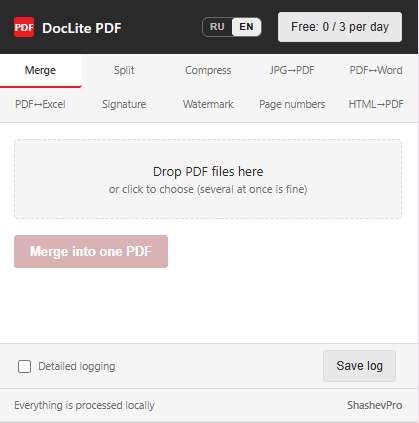
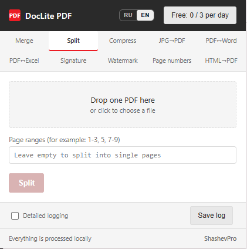
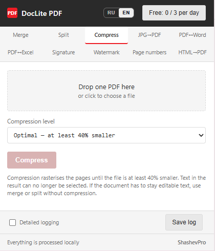
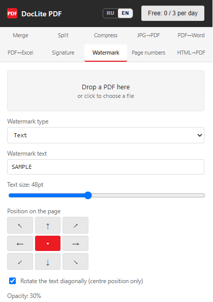
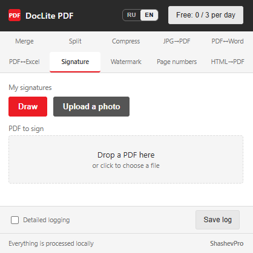
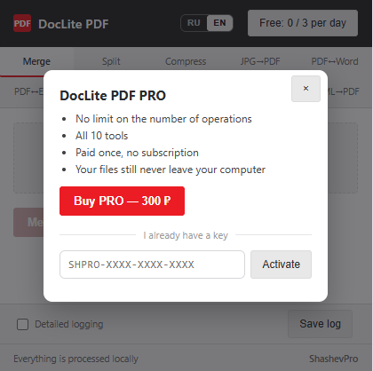

# DocLite PDF

**Ten tools for working with PDF files, right inside your browser.
Your documents are processed on your own computer and are never uploaded anywhere.**

[**Install from the Chrome Web Store**](https://chromewebstore.google.com/detail/doclite-pdf-%E2%80%94-10-%D0%B8%D0%BD%D1%81%D1%82%D1%80%D1%83%D0%BC%D0%B5/jdomnjidenomgdjpmnoegpfkjmhgfngn) · [Product website](https://www.shashevpro.ru/doclite/en/) · [Русский](README.md)

---

## What it is

A Google Chrome extension that handles everyday PDF work — without sending your
files to somebody else's server.

A typical online converter takes your document onto its server. Where it sits
there, how long it is kept and who can reach it is a matter of trust. For an
electricity bill that hardly matters. For a client contract, a scanned passport
or a financial report it matters a great deal.

DocLite works inside the browser. The file is never transmitted anywhere: the
extension does not even need an internet connection to merge or convert a PDF.
Turn off your network and see for yourself.

---

## Tools

| | What it does |
|---|---|
| **Merge** | Several files into one document, in the order you choose |
| **Split** | By page or by range, delivered as a single archive |
| **Compress** | Brings the file size down so it fits an email limit |
| **JPG → PDF** | Photos and scans collected into one document |
| **PDF ↔ Word** | Text with its paragraphs, headings and numbered items preserved |
| **PDF ↔ Excel** | Tables split into real columns, numbers stay numbers |
| **Signature** | Place an image of your signature or stamp on the page |
| **Watermark** | Text or image, with adjustable tilt and opacity |
| **Page numbers** | Any corner, starting from any number you like |
| **HTML → PDF** | Save a web page or your own markup as a document |

---

## What it looks like

| Merge | Split |
|---|---|
|  |  |

| Compress | Watermark |
|---|---|
|  |  |

| Signature | Pricing |
|---|---|
|  |  |

---

## Pricing

**Free** — three operations a day. Not "three tools out of ten", but any three:
everything is unlocked from the start, nothing is held behind a paywall. The
counter resets daily, and a failed operation does not use up an attempt.

**PRO — 300 RUB, paid once.** No subscription, no auto-renewal. A perpetual
licence for one device.

---

## Privacy

- Document contents never leave your computer and are shared with no one.
- Exactly one network request is made: the licence check when you activate the
  paid version.
- No analytics, no telemetry, no advertising networks.
- The extension does not request access to the content of the sites you visit.

Details in the [privacy policy](https://www.shashevpro.ru/doclite/en/privacy.html).

---

## Worth knowing beforehand

An honest note on the limits, so there are no false expectations:

- **Compression turns pages into images** — text in the result can no longer be
  selected. If the document has to stay editable text, use merge or split
  without compression.
- **PDF → Word and PDF → Excel work with text-based PDFs, not with scans.**
  The extension does not perform optical character recognition.
- **Conversion preserves paragraphs and structure, but not the exact layout** of
  the source document. Table borders are not reconstructed yet.

---

## Languages

The interface is available in English and Russian, switched with a button inside
the extension window. On first run the language follows your browser settings.

---

## About the source code

This repository holds the product description, not its source code: DocLite PDF
is a commercial application. Chrome Web Store policy forbids obfuscated code, so
publishing the sources would effectively mean having no licensing at all.

If you are studying how extensions like this are built, or want to discuss the
technical side, feel free to get in touch.

---

## Support

Questions, bug reports, suggestions: **programmer@shashevpro.ru**

If something misbehaves, attach a log: at the bottom of the extension window
enable "Detailed logging", repeat the action and press "Save log". A log makes
the problem far quicker to find.

---

**ShashevPro** · [shashevpro.ru](https://www.shashevpro.ru/)

