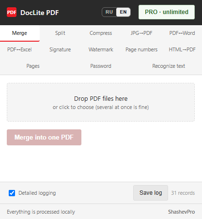
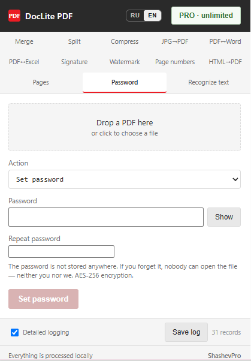
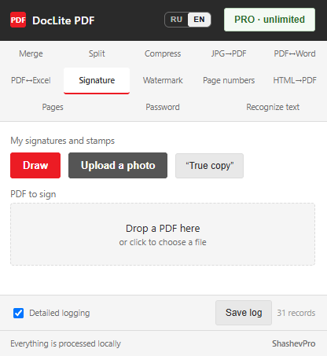
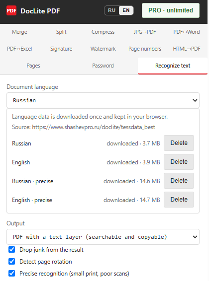
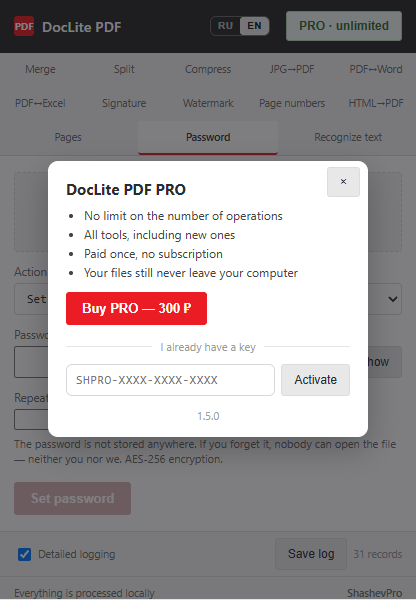

# DocLite PDF

**A document workspace right inside your browser: merge, compress, Word
and Excel, signatures and stamps, PDF passwords, page editing and text
recognition (OCR). Your documents are processed on your own computer and
are never uploaded anywhere.**

[**Install from the Chrome Web Store**](https://chromewebstore.google.com/detail/jdomnjidenomgdjpmnoegpfkjmhgfngn) · [Product website](https://www.shashevpro.ru/doclite/en/) · [Русский](README.md)

---

## What it is

A Google Chrome extension that handles everyday PDF work — without sending your
files to somebody else's server.

A typical online converter takes your document onto its server. Where it sits
there, how long it is kept and who can reach it is a matter of trust. For an
electricity bill that hardly matters. For a client contract, a scanned passport
or a financial report it matters a great deal.

DocLite works inside the browser. The file is never transmitted anywhere: the
extension does not even need an internet connection to merge or convert a PDF.
Turn off your network and see for yourself.

---

## Tools

| | What it does |
|---|---|
| **Merge** | Several files into one; set the order by dragging or with arrows |
| **Split** | By page or by range, delivered as a single archive |
| **Compress** | Brings the size down for email; large files compress in the background |
| **JPG → PDF** | Photos and scans into one document, in the order you choose |
| **PDF ↔ Word** | Paragraphs, bordered tables, images and formatting stay in place |
| **PDF ↔ Excel** | Tables with borders and merged cells; amounts and dates as real values |
| **Signature & stamps** | Signature, stamp, a “True copy” certification — on one page or all |
| **Watermark** | Text or image; several files at once |
| **Page numbers** | Any corner, any starting number; several files at once |
| **HTML → PDF** | Save a web page or your own markup as a document |
| **Pages** | Page thumbnails: reorder, rotate, delete |
| **Password** | Add or remove a PDF password, AES-256 encryption |
| **Recognize text (OCR)** | A scan or photo into a searchable PDF or Word; a precise mode too |

Recognition, conversion of large PDFs to Word and compression of large files
run in the background: queue a file, close the window, get on with your work —
a notification will offer to save the result when it is ready.

---

## What it looks like

| Merge | PDF password |
|---|---|
|  |  |

| Signature & stamps | Text recognition (OCR) |
|---|---|
|  |  |

---

## Pricing

**Free** — three operations a day. Not "three tools out of the lot", but any three:
everything is unlocked from the start, nothing is held behind a paywall. The
counter resets daily, and a failed operation does not use up an attempt.

**PRO — 300 RUB, paid once.** No subscription, no auto-renewal. A perpetual
licence for one device. All tools, including new ones.

---

## Privacy

- Document contents never leave your computer and are shared with no one.
- Only two kinds of network request are ever made: the licence check when you
  activate the paid version, and — once, only if you turn OCR on yourself —
  downloading the OCR language models (about 4 MB per language, about 15 MB
  for precise mode; after that, recognition runs offline).
- PDF passwords are added and removed on your own computer: the password is
  never sent anywhere and never stored.
- No analytics, no telemetry, no advertising networks.
- The extension does not request access to the content of the sites you visit.

Details in the [privacy policy](https://www.shashevpro.ru/doclite/en/privacy.html).

---

## Worth knowing beforehand

An honest note on the limits, so there are no false expectations:

- **Compression turns pages into images** — text in the result can no longer be
  selected. If the document has to stay editable text, use merge or split
  without compression.
- **PDF → Word and PDF → Excel work with text-based PDFs, not with scans.**
  For scans and photos, use the separate text recognition (OCR) tool.
- **Conversion keeps the layout close to the original, but not pixel for
  pixel** — complex documents are worth a quick look.
- **OCR recognizes Russian and English** and filters out obvious junk
  (patterns, stamps, watermarks), but doesn't guarantee a perfect result on
  badly damaged or very small scans. For small print and poor scans there is a
  precise mode — about 2.5 times slower. Documents with security patterns
  (forms, passports) are recognized only partly.
- **If a PDF already has text, recognition is skipped** — the text is taken
  from the document, which beats any recognition. In a mixed document only the
  pages without text are recognized.
- **Excel → PDF does not carry over pictures inside a sheet** (logos, stamps)
  or headers and footers.
- **A password can only be removed if you know it.** A file that opens without
  a password but has printing or editing restrictions can be freed of them
  without one. Other tools do not process a protected file and suggest removing
  the password first.
- **File size** — up to 300 MB per file and 600 MB in total when merging:
  everything is processed in the browser's memory.

---

## Languages

The interface is available in English and Russian, switched with a button inside
the extension window. On first run the language follows your browser settings.

---

## About the source code

This repository holds the product description, not its source code: DocLite PDF
is a commercial application. Chrome Web Store policy forbids obfuscated code, so
publishing the sources would effectively mean having no licensing at all.

If you are studying how extensions like this are built, or want to discuss the
technical side, feel free to get in touch.

---

## Support

Questions, bug reports, suggestions: **programmer@shashevpro.ru**

If something misbehaves, attach a log: at the bottom of the extension window
enable "Detailed logging", repeat the action and press "Save log". A log makes
the problem far quicker to find.

---

**ShashevPro** · [shashevpro.ru](https://www.shashevpro.ru/)

