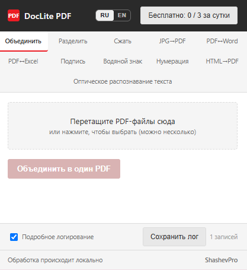
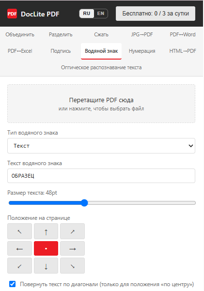
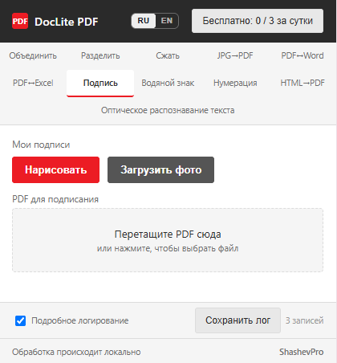
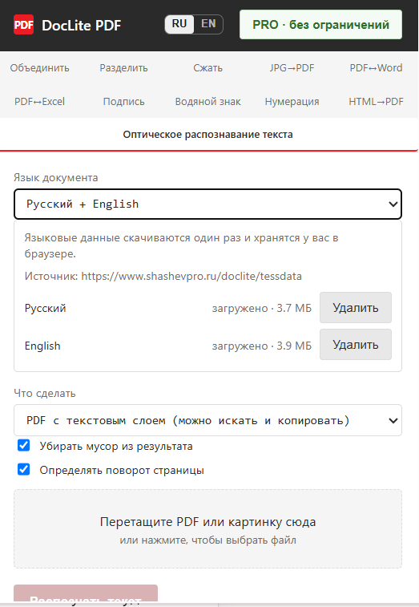
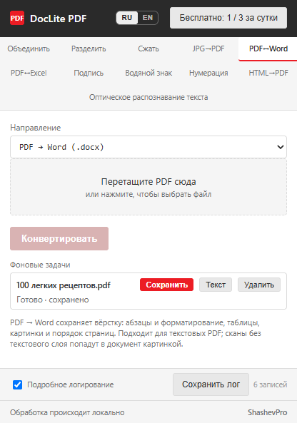

# DocLite PDF

**Одиннадцать инструментов для работы с PDF прямо в браузере, включая
распознавание текста (OCR). Документы обрабатываются на вашем компьютере
и никуда не загружаются.**

[**Установить из Chrome Web Store**](https://chromewebstore.google.com/detail/doclite-pdf-%E2%80%94-10-%D0%B8%D0%BD%D1%81%D1%82%D1%80%D1%83%D0%BC%D0%B5/jdomnjidenomgdjpmnoegpfkjmhgfngn) · [Сайт продукта](https://www.shashevpro.ru/doclite/) · [English](README.en.md)

---

## Что это

Расширение для Google Chrome, которое делает с PDF всё нужное в повседневной
работе — и делает это, не отправляя ваши файлы на чужой сервер.

Обычный онлайн-конвертер принимает документ к себе. Где он там лежит, сколько
хранится и кто имеет к нему доступ — вопрос доверия. Для квитанции за свет это
неважно. Для договора с клиентом, скана паспорта или бухгалтерского отчёта —
важно очень.

DocLite работает внутри браузера. Файл не передаётся никуда: расширению не нужен
интернет, чтобы объединить или конвертировать PDF. Можно отключить сеть и
убедиться самому.

---

## Инструменты

| | Что делает |
|---|---|
| **Объединить** | Несколько файлов в один документ, порядок задаёте сами |
| **Разделить** | По страницам или диапазонам, результат одним архивом |
| **Сжать** | Уменьшает вес, чтобы документ прошёл по ограничениям почты |
| **JPG → PDF** | Фотографии и сканы собираются в один файл |
| **PDF ↔ Word** | Текст с сохранением абзацев, заголовков и нумерованных пунктов |
| **PDF ↔ Excel** | Таблицы разбираются по столбцам, числа остаются числами |
| **Подпись** | Изображение подписи или печати в нужное место страницы |
| **Водяной знак** | Текст или картинка, наклон и прозрачность настраиваются |
| **Нумерация** | Номера страниц в любом углу, с любой начальной цифры |
| **HTML → PDF** | Веб-страница или свой HTML сохраняется как документ |
| **Распознавание текста (OCR)** | Скан или фото — в PDF с текстовым слоем или сразу в Word |

Распознавание и конвертация больших PDF в Word идут в фоне: поставили задачу,
закрыли окно, занимаетесь своими делами — по готовности придёт уведомление
с предложением сохранить результат.

---

## Как выглядит

| Объединение | Водяной знак |
|---|---|
|  |  |

| Подпись | Распознавание текста (OCR) |
|---|---|
|  |  |

**Работа в фоне** — задачу можно поставить и закрыть окно, обработка продолжится:

---

## Сколько стоит

**Бесплатно** — три операции в сутки. Не «три инструмента из одиннадцати», а любые
три: всё открыто сразу, ничего не заперто за платной стеной. Счётчик обнуляется
каждый день, а ошибка обработки попытку не расходует.

**PRO — 300 ₽ один раз.** Без подписки и автопродления. Лицензия бессрочная,
на одно устройство.

---

## Приватность

- Содержимое документов не покидает ваш компьютер и не передаётся никому.
- В сеть уходят только два вида запросов: проверка ключа при активации
  платной версии и — один раз, только если вы сами включите распознавание
  текста — скачивание языковых моделей OCR (около 4 МБ на язык, дальше
  распознавание работает офлайн).
- Ни аналитики, ни счётчиков, ни рекламных сетей в расширении нет.
- Доступа к содержимому посещаемых сайтов расширение не запрашивает.

Подробнее — в [политике конфиденциальности](https://www.shashevpro.ru/doclite/privacy.html).

---

## О чём стоит знать заранее

Здесь честно про границы, чтобы не было обманутых ожиданий:

- **Сжатие переводит страницы в изображение** — текст в результате перестаёт
  выделяться. Если документ должен остаться редактируемым текстом, используйте
  объединение или разделение без сжатия.
- **PDF → Word и PDF → Excel работают с текстовыми PDF, а не со сканами.**
  Для сканов и фото — отдельный инструмент, распознавание текста (OCR).
- **При конвертации сохраняются абзацы и структура, но не точная вёрстка**
  исходного документа. Рамки таблиц пока не восстанавливаются.
- **OCR распознаёт русский и английский языки** и убирает явный мусор
  (узоры, печати, водяные знаки), но не гарантирует идеальный результат
  на сильно повреждённых или очень мелких сканах. Документы с защитной сеткой
  (бланки, паспорта) и фотографии документов — не его задача.
- **Если в PDF уже есть текст, распознавание не запускается** — текст берётся
  из документа, это точнее любого распознавания. В документе со смешанными
  страницами распознаются только страницы без текста.
- **Excel → PDF не переносит картинки внутри листа** (логотипы, печати)
  и колонтитулы.

---

## Языки

Интерфейс на русском и английском, переключается кнопкой в окне расширения.
При первом запуске язык подбирается по настройкам браузера.

---

## Об исходном коде

Репозиторий содержит описание продукта, а не его исходный код: DocLite PDF —
коммерческое приложение. Правила Chrome Web Store запрещают обфускацию кода,
поэтому опубликованные исходники означали бы отсутствие лицензирования как
такового.

Если вы изучаете, как устроены подобные расширения, или хотите обсудить
техническую сторону — пишите, отвечу.

---

## Поддержка

Вопросы, сообщения об ошибках, предложения: **programmer@shashevpro.ru**

Если что-то работает не так, приложите к письму лог: в окне расширения внизу
включите «Подробное логирование», повторите действие и нажмите «Сохранить лог».
По логу проблема находится в разы быстрее.

---

**ShashevPro** · [shashevpro.ru](https://www.shashevpro.ru/)

